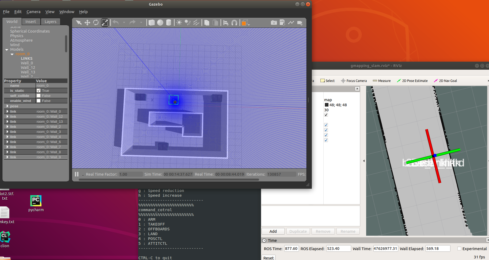
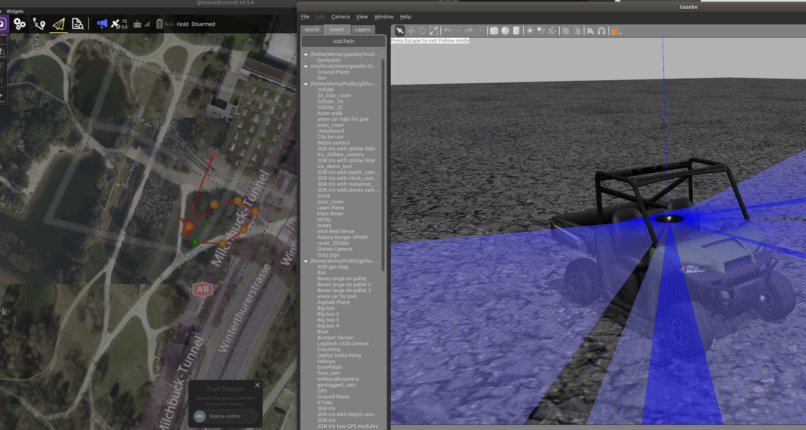
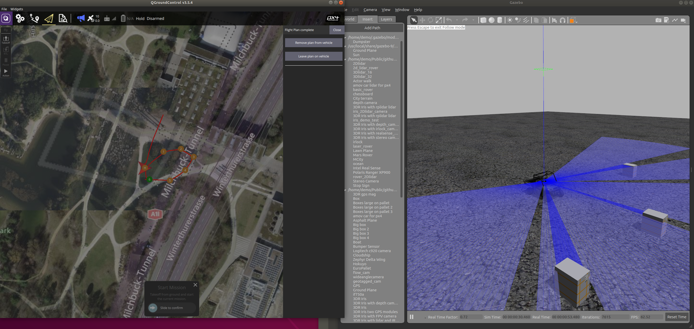

This px4 simulation includes 2D, 3D lidar models, depth camera models,  track camera models, realsense camera models, and IRlock camera models.


- Setup ROS Melodic and PX4 environment

- Setup gazebo models and plugins

- Compile Firmware and ROS project 


## Setup ROS and PX4

### ROS Melodic


1. Add ROS to sources.list.

   ```bash
   echo "deb http://packages.ros.org/ros/ubuntu $(lsb_release -sc) main" > /etc/apt/sources.list.d/ros-latest.list
   sudo apt-key adv --keyserver 'hkp://keyserver.ubuntu.com:80' --recv-key C1CF6E31E6BADE8868B172B4F42ED6FBAB17C654
   sudo apt update
   ```

2. Install gazebo with ROS.

   ```bash
   sudo apt-get install ros-melodic-desktop
   
   # Source ROS
   source /opt/ros/melodic/setup.bash
   ```

  please make sure install ros-gazebo related packages


  ```
  sudo apt install ros-melodic-gazebo9*
  sudo apt-get install ros-melodic-gmapping
sudo apt-get install ros-melodic-cartographer*
sudo apt-get install ros-melodic-rtabmap*
sudo apt-get install ros-melodic-ddynamic-reconfigure
sudo apt-get install ros-melodic-ar-track-alvar*
sudo apt-get install ros-melodic-velodyne-gazebo-plugins
sudo apt-get install ros-melodic-moveit 
sudo apt-get install ros-melodic-nav-core

  ```

3. Initialize rosdep.

   ```bash
   rosdep init
   rosdep update
   ```

4. Install catkin.

   ```bash
   sudo apt install python-catkin-tools
   ```

5. Install mavros version 0.29.0+ 

   ```bash
   sudo apt install ros-melodic-mavros ros-melodic-mavros-extras
   ```

6. Install the geographiclib dataset

   ```bash
   wget https://raw.githubusercontent.com/mavlink/mavros/master/mavros/scripts/install_geographiclib_datasets.sh
   chmod +x install_geographiclib_datasets.sh
   sudo ./install_geographiclib_datasets.sh
   ```


### PX4 Firmware


Download firmware 

```
cd ~/some
git clone https://github.com/PX4/PX4-Autopilot.git Firmware
```

make sure the below simulation can show up

```
cd Firmware
git submodule update --init --recursive
git checkout v1.11.0
make distclean
make px4_sitl_default gazebo
```


If any errors make sure plugins exists


for ubuntu 18.04

```
sudo apt-get install ros-melodic-velodyne-gazebo-plugins
```

```
cd ~/some
catkin_make
```

```
source source_enviroment.sh
```


run model demo launch files 

```
roslaunch simulation {xxx}.launch
```

## Gmapping_slam


run

```
roslaunch simulation gmapping_demo_px4.launch
```


```
dir:some/src/simulation/scripts/README.md
```

### 2Dlidar location

Before running the demo some parameter in QGC needs to be seetup first

```
EKF2_AID_MASK = 24
```

Run

```
roslaunch simulation cartographer2Dlidar_location_demo_px4.launch
```

Before positioning, please use the **'g'** key of the keyboard to adjust the allowable speed of the uav to 1570 on the keyboard control interface, and reduce the tilt angle and speed of the uav during movement to achieve a better positioning effect.


### 2Dlidar mapping

If you want to build a more accurate map and your robot already has an odometer. Then cartogra can generate accurate and stable maps, and there will be no situation where the map will float in the location mode.

Before running the demo, please configure the parameters in the QGC parameter table and select the EKF location source from gps

```
EKF2_AID_MASK = 1
```

The cartogra node will receive 2d lidar and odometer topics for drones

```
roslaunch simulation cartographer2Dlidar_mapping_demo_px4.launch
```

### 3Dlidar location


For ubuntu 18.04

```
sudo apt-get install ros-melodic-velodyne-gazebo-plugins
```
Using a 16-line lidar, along with an imu data, the lidar is mounted horizontally on top of the aircraft. As far as the positioning effect is concerned, there is no situation that the 2Dlidar will float when positioning, and the speed and tilt angle of the drone can be greatly improved.


Run

```
roslaunch simulation cartographer3Dlidar_demo_px4.launch
```

### VFH with iris


run
```
roslaunch simulation obstacle_avoidance_2Dlaser_vfh_px4.launch
```
### circular_rover


run
```
roslaunch simulation circular_rover.launch 
```

### 2Dliar rover obstacle avoidance




run
```
roslaunch simulation obstacle_avoidance_2Dlaser_rover.launch  
```

